## 2.1 네트워크 기초

- 네트워크는 노드와 링크가 서로 연결되어 있고, 리소스를 공유하는 집합
- 노드 ex) 서버, 라우터, 스위치 등
- 링크 ex) 유선, 무선을 의미

### 2.1.1 처리량과 지연 시간

- 좋은 네트워크란?
  - 많은 처리량 처리, 지연 시간이 짧음, 장매 빈도가 적음, 좋은 보안을 갖춘 네트워크
- 처리량이란?
  - 링크 내에서 성공적으로 전달된 데이터의 양을 의미, 얼만큼의 트래픽을 처리했는지 의미. **"많은 트래픽 처리" = "많은 처리량"**
  - 처리량의 단위는 bps (bits per second), 초당 전송 또는 수신되는 비트 수
- 트래픽이란? 
  - 특정 시점에 링크 내에 **흐르는** 데이터의 양
  - 예로 서버에 저장도니 파일 (이미지, 문서, 동영상 등)을 클라이언트가 다운로드할 때 발생되는 데이터 누적량

- 트래픽이 많아졌다
  - 흐르는 데이터가 많아졌다. 예로 실패 성공 데이터 다 포함
- 처리량이 많아졌다
  - 처리되는 트래픽이 많아졌다. 즉 성공적으로 전달된 데이터가 많아졌다를 의미

- 대역폭이란?
  - 주어진 시간 동안 네트워크 연결을 통해 흐를 수 있는 최대 비트 수
  - 단위 시간당 전송할 수 있는 최대 데이터 양
  - 보통 Mbps (Megabits per second) 같은 단위로 표현
  - 예: 100Mbps 대역폭이 있다면, 초당 최대 100메가비트까지 데이터를 전송할 수 있음

- 지연시간이란?
  - 요청이 처리되는 시간을 의미. 어떤 메세지가 두 장치 사이를 왕복하는데 걸리는 시간을 의미
  - 지연시간은 매체 타입, 패킷 크기, 라우터 패킷 처리 시간에 영향을 받음

### 2.1.2 네트워크 토폴리지와 병목 현상

- 네트워크 토폴로지란?
  - 네트워크의 노드와 링크가 어떻게 배치되어 있는지에 대한 방식, 연결 형태를 의미

- 트리 토폴로지
  - 트리 토폴로지는 계층형 토폴로지, 트리 형태의 네트워크 구성
  - 장점: 노드 추가 삭제가 쉬움
  - 단점: 특정 노드에 트래픽이 집중되면 하위 노드에 영향을 미침
- 버스 토폴로지
  - 중앙 통신 회선 하나에 여러 개의 노드가 연결되어 공유하는 네트워크 구성을 의미
  - 근거리 통신망에 사용
  - 장점: 설치 비용 적음, 노드 추가, 삭제가 쉬움
  - 단점: 스푸핑이 가능한 이슈, 중앙 케이블이 다운되면 전체 다운
- 스푸핑이란? 
  - 스푸핑은 LAN상 송신부의 패킷을 송신과 관련 없는 호스트에 가지 않도록 하는 스위칭 기능을 마비 시키고 또는 속여 악의적인 노드에 해당 패킷이 오도록 처리하는 방식

<br/>

<div style="display: flex;">
  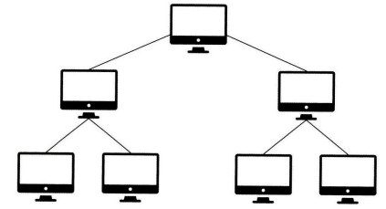
  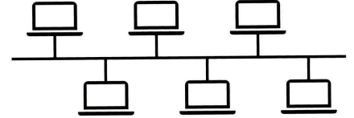
  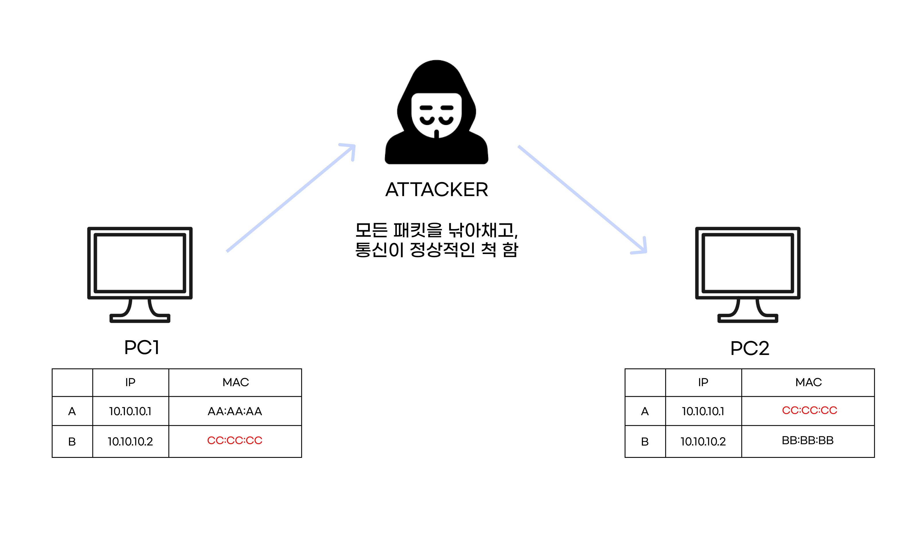
</div>

<br/>

- 스타 토폴로지
  - 중앙에 있는 노드에 모두 연결된 네트워크 구성
  - 장점: 노드 추가 쉬움, 에러 탐지 쉬움, 패킷 충돌 가능성 저하, 장애 노드가 중앙이 아니라면 다른 노드 영향 저하
  - 단점: 중앙 노드 이슈 발생 시 전체 네트워크 사용 불가, 설치 비용 고가
  - ex) 와이파이 무선 네트워크, 가정요 네트워크

- 링형 토폴로지
  - 각각의 노드가 양 옆의 두 노드와 연결해 고리처럼 하나의 연결고리 망 구성 형식
  - 데이터를 노드에서 노드로 이동
  - 장점:노드 수가 증가 되어도 네트워크상의 손실이 거의 없고, 충돌이 발생되는 가능성이 적음
  - 단점: 네트워크 구성 변경이 어려움. 회선에 장애가 발생한다면 전체 네트워크에 영향을 끼침.

- 메시 토폴로지
  - 그물망처럼 연결되는 구조
  - 장점: 한 노드에서 장애가 발생해도 여러 개의 경로가 존재하기 때문에 네트워크 지속 사용 가능 및 분산 처리 가능
  - 단점: 노드 추가 어려움, 구축 비용 및 운영 비용 비쌈

<br/>

<div style="display: flex;">
  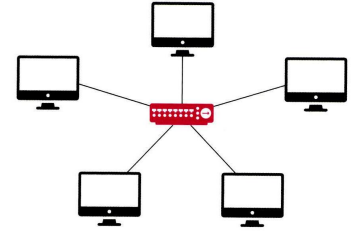
  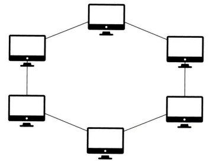
  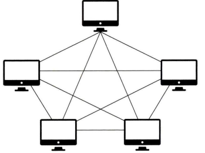
</div>

<br />

- 병목현상이란?
  - 전체 시스템의 성능이 하나의 구성 요소로 인해 제한 받는 현상
  - 네트워크 구조인 토폴리지가 중요한 이유 -> 병목 현상을 찾을 때 중요한 기준이 되기 떄문
- 병목현상 예시
  - 네트워크: 데이터가 빠르게 오가지만, 라우터나 스위치가 처리 못 해서 지연 발생
  - 서버: DB 쿼리는 빠른데, API 응답이 느릴 경우
  - 프론트엔드: 리액트 렌더링은 빠른데, 무거운 이미지 로딩 때문에 화면이 늦게 뜨는 경우

### 2.1.3 네트워크 분류

- LAN, MAN, WAN
  - LAN: 근거리 통신망 예로 캠퍼스나 건물에서 운영되는 통신망. 전송 속도 빠르고 혼잡하지 않음.
  - MAN: 대도시 지역에서 사용하는 통신망 (지역). 전송 속도 보통, LAN 보다 혼잡.
  - WAN: 광역 네트워크 의미 (대륙, 국가), 전송 속도 낮음, MAN 보다 혼잡.

### 2.1.4 네트워크 성능 분석 명령어

- 네트워크 성능 분석 명령어
  - ping: 네트워크 상태 확인 원하는 대상 노드를 향해 일정 크기의 패킷을 전송해서 네트워크가 연결되어 있는지 확인 가능한 명령어 (TCP/IP ICMP 프로토콜에서 동작)
  - netstat: 접속되어 있는 서비스들의 네트워크 상태를 표시하는 것에 사용. 네트워크 접속, 라우팅 테이블, 네트워크 프로토콜 등 리스트를 보여줌. 서비스 포트 열려 있는지 확인 가능
  - nslookup: DNS 관련된 내용을 확인하기 위한 명령어. 특정 도메인에 매핑된 IP 확인을 위함.
  - tracert, traceroute: 목적지 노드까지 네트워크 경로를 확인할 때 사용하는 명령어

### 2.1.5 네트워크 프로토콜 표준화

- 네트워크 프로토콜이란?
  - 다른 장치들끼리 데이터를 주고받기 위해 설정된 공통된 인터페이스
  - 개인, 기업이 아닌 IEEE, IETF라는 표준화 단체가 정함
  - 웹을 접속할 때 HTTP 프로토콜을 통해 노드들은 웹 서비스를 기반으로 데이터를 주고 받을 수 있음

## 2.2 TCP / IP 4계층 모델

### 2.2.1 계층 구조

- TCP/IP 계층은 네 개의 계층을 갖고 있음
- 계층들은 특정 계층이 변경되었을 때 다른 계층은 영향을 받지 않음

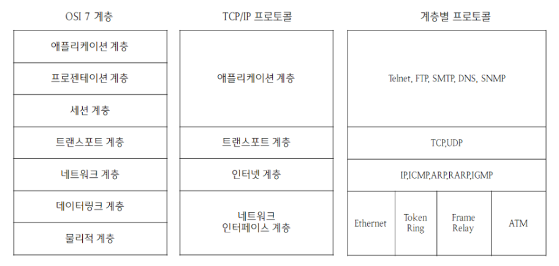

- 애플리케이션 계층이란?
    - 애플리케이션 계층은 FTP, HTTP, SSH, SMTP, DNS 등 응용 프로그램이 사용되는 프로토콜 계층
    - 웹 서비스, 이메일 등 서비스를 실질적으로 사람들에게 제공하는 계층

- FTP란?
    - 장치와 장치 간의 파일을 전송하는 것에 사용되는 프로토콜
- SSH란?
    - 네트워크 서비스를 안전하게 운영하기 위한 암호화 네트워크 프로토콜
- HTTP란?
    - www를 위한 데이터 통신의 기초고, 웹 사이트를 이용하는 것에 사용하는 프로토콜
- SMTP란?
    - 전자 메일 전송을 위한 인터넷 표준 통신 프로토콜
- DNS란?
    - 도메인과 DNS를 매핑 해주는 서버

- 전송 계층이란?
    - 송신자 수신자를 연결하는 통신 서비스 제공
    - 애플리케이션과 인터넷 계층 사이의 데이터가 전달될 때 중계 역할
    - TCP와 UDP 존재
        - TCP는 가상 패킷 교환 방식을 사용
        - UDP는 데이터그램 패킷 교환 방식 사용
- 가상회선 패킷 교환 방식이란?
    - 각 패킷에는 가상회선 식별자가 포함되어 모든 패킷을 전송하면 가상회선이 해제되고 패킷들은 전송된 ‘순서대로’ 도착하는 방식
        - **패킷(Packet)**
            
            데이터를 일정한 크기로 나눈 조각. 인터넷에서는 큰 파일이나 메시지를 여러 패킷으로 나눠 전송.
            
        - **가상회선(Virtual Circuit)**
            
            실제 물리적인 선은 아니고, 네트워크 장비(라우터, 스위치 등)를 거치면서 설정된 **논리적인 경로**를.
            
            → 이 경로는 마치 우리가 전화를 걸 때 한 번 연결을 맺고, 그 연결을 통해 대화하는 것처럼 작동
            
        - **식별자(Identifier)**
            
            각 패킷에는 **가상회선을 식별할 수 있는 정보**가 포함. 이걸 보고 중간 장비들이 이 패킷을 어디로 보낼지 결정.

    <br/>

📦 동작 흐름
1. **가상회선 설정**
  - 데이터를 보내기 전에, 송신자와 수신자 사이의 경로를 설정함.
  - 이 경로는 네트워크 내 라우터나 스위치에 의해 기억됨.
    
2. **데이터 전송 (Data Transfer)**
  - 설정된 경로를 통해 모든 패킷이 전송.
  - 각 패킷은 "나는 이 가상회선 경로의 일부야"라는 식별자를 가지고 있음.
  - **따라서 중간 장비들이 라우팅할 때 이 경로만 보면 되기 때문에 속도가 빨라질 수 있음.**
  - **패킷은 설정된 경로로만 가기 때문에 수신자는 항상 순서대로 데이터를 받음.**
    
3. **가상회선 해제**  
  - 모든 데이터를 전송하면, 설정해놓은 가상회선을 해제.
  - 네트워크 자원을 회수함.
    
  ```
  📌 예시
  > 비유: 지하철 노선
  - 서울에서 부산까지 가는 **KTX 노선**이 있다고 함.
  - 내가 보낼 데이터는 여러 사람으로 나뉘어서 이 노선을 타고 출발함.
  - KTX 노선은 미리 정해져 있고(가상회선), 중간에 타고 내릴 수도 없고, 사람들이 순서대로 도착함.
  - 사람들이 부산에 다 도착하고 나면(전송 완료), 이 노선은 다음 승객을 위해 초기화됨(해제).
  ```

- 데이터 그램 패킷 교환 방식
    - 패킷이 독립적으로 이동해 최적의 경로를 선택해 감
        - 이 말은 곧, **전송 시점의 네트워크 상황에 따라 유동적으로 경로가 바뀔 수 있음.**
    - 하나에 메시지에서 분할된 여러 패킷은 서로 다른 경로로 전송될 수 있고, **도착한 순서가 다를 수 있음**
        - 수신 측에서는 이 패킷들을 **재조립**하는 작업이 필요함.
    - 가상회선 방식과 달리, 사전에 연결을 설정하지 않음. 신뢰성 낮음. 따라서 연결 설정이나 해제 과정이 없기 때문에 빠름.
  
```
📌 예시
> 비유: 일반 우편
- 어떤 친구에게 긴 편지를 보내기 위해 편지를 5장으로 나눠서 일반 우편으로 보냄.
- 5장의 편지는 각각 독립적으로 발송되고, **배달 경로가 다를 수 있음**.
- 어떤 건 빠르게, 어떤 건 느리게 도착할 수도 있음.
- 심지어 3장이 먼저 도착하고, 2장이 나중에 올 수도 있음.
- 결국 친구는 편지를 받은 순서가 아니라 **번호를 보고 정렬한 후에** 전체 메시지를 이해함.
```

- TCP 연결 성립 과정
    - 신뢰성을 확보할 때 3-웨이 핸드쉐이트 작업 진행
        1. SYN 단계: 클라에서 서버에 클라 ISN을 담아 SYN을 보냄. ISN은 새로운 TCP 연결의 첫 번째 패킷에 할당된 임의의 시퀀스 번호
        2. SYN + ACK 단계: 서버는 클라이언트의 SYN을 수신하고, 서버의 ISN을 보내며 승인번호로 클라이언트의 ISN + 1 보냄
        3. ACK 단계: 클라이언트는 서버의 ISN + 1 값인 승인번호를 담아 ACK를 서버에 보냄
    - **위와 같은 작업 진행 후 신뢰성이 구축되고 데이터 전송 시작**
    - TCP는 3-웨이 핸드쉐이크 과정이 있기 때문에 신뢰성이 있는 계층이라고 하고, UDP는 이런 과정이 없기 때문에 신뢰성이 없는 계층이라고 함
- TCP 연결 해제 과정
    - 연결 해제할 때 4-웨이 핸드쉐이크 과정 발생
        1. 클라이언트가 연결을 닫으려고 할 때 FIN으로 설정된 세그먼트를 보냄. 클라이언트는 FIN_WAIT_1 상태로 들어감. 서버의 응답을 기다림
        2. 서버는 클라이언트로 ACK라는 승인 세그먼트 보냄. CLOSE_WAIT 상태에 들어감. 클라이언트가 세그먼트를 받으면 FIN_WAIT_2 상태에 들어감
        3. 서버는 ACK를 보내고 일정 시간 뒤 클라이언트에 FIN이라는 세그먼트를 보냄
        4. 클라이언트는 TIME_WAIT 상태가 되고, 다시 서버로 ACK를 보내서 서버는 CLOSED 상태가 됨. 이후 클라이언트는 일정 시간 대기 후에 연결이 닫히고 클라이언트와 서버의 모든 자원 연결이 해지함
- TCP 연결 해제 과정 중 TIME_WAIT을 하는 이유
    - 지연 패킷이 발생할 경우 대비
    - 패킷이 늦게 되달해서 처리하지 못하면 데이터 무결성 이슈
    - 두 장치가 연결이 닫혔는지 확인하기 위해
- 세그먼트란?
    - 그 중에서 **TCP 계층**(전송 계층)에서는 데이터를 일정 크기로 나눠서 전송하는데, 그 조각 하나하나을 의미
    - 세그먼트에는 실제 데이터뿐 아니라, 보내는 쪽/받는 쪽 포트 번호, 순서 번호, 확인 응답 번호, 플래그(FIN, ACK, SYN 등) 같은 정보도 포함

---

> 추가적인 내용

1. HTTP는 TCP 위에서 동작한다(1.0, 2.0)
- 우리가 사용하는 `fetch`, `axios` 같은 API 요청은 대부분 **HTTP/HTTPS 프로토콜**을 사용
- 이 HTTP는 **TCP 기반**이기 때문에, 요청을 보낼 때 **TCP 연결이 되어야 함**
- 즉, 요청 하나가 가기 전에 **3번의 왕복 핸드셰이크가 오고 간다면 페이지 로딩 속도와 서버 부하에 큰 영향을 미침 (HTTP 1.0)**
→ keep-alive 속성 추가 해결 방법

2. HTTP/1.1 이후에서 `keep-alive` 필요 여부
- 1.1부터는 keep-alive 값이 기본으로 동작

3. HTTP는 TCP 위에서 동작했지만 3.0부터는 아님
- UDP 에 기반한 QUIC 프로토콜을 사용

4. 📦 계층 구조
```jsx
[응용 계층]      →  HTTP (요청/응답)
[전송 계층]      →  TCP (신뢰성 있는 데이터 전송)
[네트워크 계층]  →  IP (주소 지정 및 라우팅)
[링크 계층]      →  Ethernet, Wi-Fi (물리적 전송)
```

5. 실질적 작동 흐름 예시
> 브라우저 → 서버에 HTTP 요청 보내기의 과정은 다음과 같음

```  
1. 클라이언트(브라우저)는 **TCP 연결 생성 (3-way handshake)**  
  → `SYN → SYN-ACK → ACK`
2. TCP 연결이 완료되면, 브라우저는 HTTP 요청을 TCP를 통해 보냄
  → 예: `GET /index.html HTTP/1.1`
3. 서버는 응답을 TCP를 통해 전달
  → 예: `HTTP/1.1 200 OK` + HTML 본문
4. **HTTP/1.0에서는** 이 요청/응답이 끝나면 TCP 연결을 끊음
  **HTTP/1.1 이상에서는** `keep-alive`로 연결을 재사용함
```

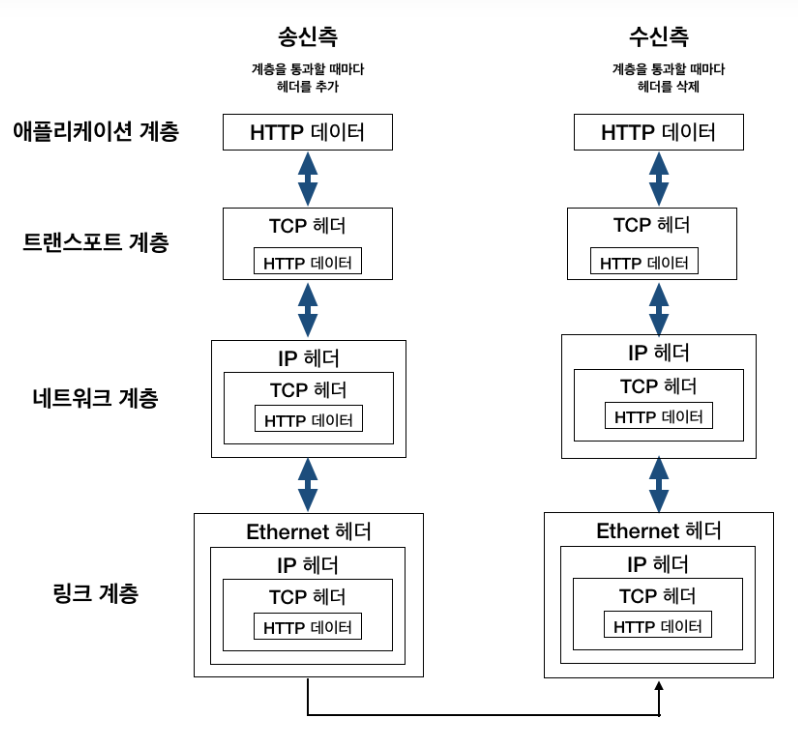
    
- 네이버 접속 시나리오
1. 웹 브라우저에 www.naver.com 입력.
2. DNS로 네이버 서버 IP주소 할당
    
    [www.naver.com](http://www.naver.com) → 223.130.200.107 로 변경 (애플리케이션 계층)
    
3. 응용 계층(L4)에서 메세지 데이터 패킹(HTTP 메시지)
 브라우저가 요청할 정보를 담은 HTTP Request 메시지 구성
    
    ```jsx
    GET / HTTP/1.1
    Host: www.naver.com
    User-Agent: Chrome/...
    ```
    
4. 전송 계층(L3)에서 PORT정보(출발지, 목적지), 전송제어 정보, 순서 정보, 검증 정보 패킹 (TCP)
HTTP 메시지를 TCP 세그먼트로 감쌈
→ 이 과정에서 3-way handshake 발생: 전송 계층
5. 인터넷 계층(L2)에서 IP정보(출발지, 목적지) 패킹
→ TCP 세그먼트를 IP 패킷으로 감쌈: 인터넷 계층
6. 네트워크 엑세스(L1) 계층에서 MAC주소 패킹
→ IP 패킷을 이더넷 프레임으로 감쌈: ****데이터 링크 계층
7. 게이트웨이를 통해 인터넷망 접속.
→ 모든 정보를 다 담은 프레임을 전기 신호 or 무선 신호로 바꿔 실제로 네트워크 케이블이나 와이파이 통해 전송: 물리 계층
8. 라우터를 통해 목적지(네이버 서버)를 찾아 연결.
9. 네이버 서버에 도착하면 패킷을 하나 하나 까면서 목적 포트에 메세지 데이터 전달하여 다시 응답.

출처: [https://inpa.tistory.com/entry/WEB-🌐-TCP-IP-정리-👫🏽-TCP-IP-4계층](https://inpa.tistory.com/entry/WEB-%F0%9F%8C%90-TCP-IP-%EC%A0%95%EB%A6%AC-%F0%9F%91%AB%F0%9F%8F%BD-TCP-IP-4%EA%B3%84%EC%B8%B5)

---

- 인터넷 계층이란?
    - 장치로 받은 네트워크 패킷을 IP 주소로 지정된 목적지로 전송하기 위해 사용하는 계층
    - 상대방이 제대로 받았는지 보장하지 않는 비연결형적인 특징을 가짐
- 링크 계층(네트워크 계층)이란?
    - 전선, 광섬유, 무선 등 실질적인 데이터를 전달하고 장치 간에 신호를 주고받는 규칙을 정하는 계층
    - 링크 계층을 물리 계층, 데이터 링크 계층으로 나누기도 함
    - 물리 계층은 무선 LAN, 유선 LAN을 통해 0,1을 사용해서 데이터를 보내는 계층을 의미
    - 데이터 링크 계층은 이더넷 프레임을 통해 에러 확인, 흐름 제어, 접근 제어를 담당
- 유선 LAN
    - IEEE802.3이라는 프로토콜을 따르고 전이중화 통신 사용
- 전이중화 통신이란?
    - 양쪽 장치가 동시에 송수신할 수 있는 방식을 의미
    - 송신로와 수신로로 나눠서 데이터를 주고 받음
    - 현대의 고속 이더넷은 이 방식 기반 통신
- 유선 LAN을 이루는 케이블
    - 트위스트 페어 케이블
    - 광섬유 케이블
- 무선 LAN
    - 수신과 송신에 같은 채널 사용. 반이중화 통신을 사용
- 반이중화 통신이란?
    - 양쪽 장치는 서로 통신 가능하지만, 동시에는 통신할 수 없으며 한 번에 한 방향만 통신할 수 있는 방식

### 계층 간 데이터 송수신 과정

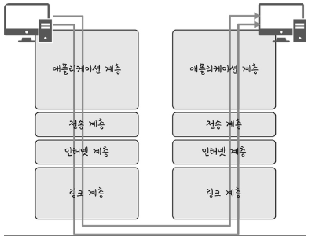

- 만약 내 컴퓨터에서 다른 컴퓨터의 데이터를 요청하게 된다면 애플리케이션 계층에서 전송 계층으로 필자가 보내는 요청 값이 캡슐화 과정을 통해 전달. 다시 링크 계층을 통해 해당 서버와 통신해서 해당 서버의 링크 계층으로부터 애플리케이션까지 비캡슐화 과정을 거쳐 데이터가 전송

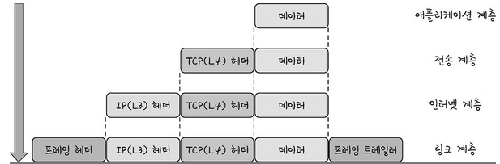

- 캡슐화 과정: 해당 계층의 헤더를 삽입하는 과정
    - 전송 계층: ‘세그먼트’ 또는 ‘데이터그램’화 되며 TCP(L4) 헤더가 붙음
    - 인터넷 계층: IP(L3) 헤더가 붙음. 패킷화
    - 링크 계층: 프레임 헤더와 프레임 트레일러가 붙어 프레임화
- 비캡슐화 과정: 하위 계층에서 상위 계층으로 가며 계층의 헤더 부분을 제거하는 과정
    - 캡슐화 된 데이터를 받게 되면 링크 계층부터 타고 올라가며 프레임화 → 패킷화 → 데이터그램화 → 메시지화 비캡슐화 과정 발생. 최종적으로 PDU인 메세지로 전달

### 2.2.2 PDU

- PDU란?
    - 네트워크 계층에서 어떠한 계층으로 전달될 때 한 덩어리의 단위를 PDU라고 함
    - 제어관련 정보들이 포함된 ‘헤더’, 데이터를 의미하는 ‘페이로드’로 구성
    - 계층마다 부르면 명칭이 다름
        - 애플리케이션 계층: 메시지
        - 전송 계층: 세그먼트(TCP), 데이터그램(UDP)
        - 인터넷 계층: 패킷
        - 링크 계층: 프레임, 비트

## 2.3 네트워크 기기

### 2.3.1 네트워크 기기의 처리범위

- 상위 계층이 하위 계층을 처리할 수 있음. 반대는 불가
- 애플리케이션 계층: L7 스위치
- 인터넷 계층: 라우터: L3 스위치
- 데이터 링크 계층: L2 스위치, 블지
- 물리 계층: NIC, 리피터, AP

### 2.3.2 애플리케이션 계층을 처리하는 기기

- L7 스위치
    - 여러 장비 연결하고 데이터 통신 중재. 목적지가 연결된 포트로만 전기 신호를 보내는 데이터를 전송하는 통신 네트워크 장비
    - 로드밸런서라고 하며, 서버의 부하를 분산하는 기기
    - 클라이언트로부터 오는 요청들을 여러 서버로 나누는 역할을 함
    - 시스템이 처리할 수 있는 트래픽 증가를 목표로 함
    - URL, 서버, 캐시, 쿠키들을 기반으로 트래픽 분산
    - 바이러스, 불필요한 외부 데이터 등을 필터링 기능
    - 장애가 발생한 서버가 있다면 트래픽 분산 대상에서 제외해야 하는데, 주기적인 헬스 체크를 이용해 감시하며 이뤄짐
- L4 스위치와 L7 스위치 차이
    - L4 스위치는 전송 계층에서 처리하는 기기. 스트리밍 관련 서비스에서 사용 불가.
    - 메세지를 기반으로 인식하지 못하고 IP와 포트를 기반으로 트래픽 분산.
    - L7 로드밸런서는 IP, 포트 외에도 URL, HTTP, 헤더, 쿠키 등을 기반으로 트래픽 분산.
- 헬스 체크
    - L4 스위치, L7 스위치 모두 헬스 체크를 통해 정상적인 서버인지 판단.
    - 전송 주기와 재전송 횟수 등을 설정한 이후 반복적으로 서버에 요청을 보내는 것을 의미
    - 적절하게 요청 횟수를 설정 (서버가 부하가 가지 않게)
    - TCP, HTTP 등 다양한 방법을 통해 요청
- 로드밸런서를 이용한 서버 이중화
    - 서비스를 안정적으로 운영하기 위한 2대의 서버를 두고 한 개의 서버가 종료되더라도 다른 한 대를 통해 안정적인 서버를 제공

### 2.3.3 인터넷 계층을 처리하는 시기

- 라우팅
    - 다른 네트워크에 존재하는 장치끼리 서로 데이터를 주고 받을 경우 패킷 소모를 최소화하고, 경로를 최적화해 최소 경로로 패킷을 포워딩하는 라우팅 장비
- L3 스위치
    - L2 스위치의 기능과 라우팅 기능을 갖춘 장비

### 2.3.4 데이터 링크 계층을 처리하는 기기

- L2 스위치
    - MAC 주소를 MAC 주소 테이블을 통해 관리, 연결된 장치로부터 패킷이 왔을 때 패킷 전송을 담당
- 브리지
    - 두 개의 근거리 통신망(LAN)을 상호 접속할 수 있도록 하는 통신망 연결 장치
    - 포트와 포트 사이의 다리 역할
    - MAC 주소를 MAC 주소 테이블로 관리
    - 통신망 범위를 확장하고 서로 다른 LAN 등으로 이루어진 **하나의** 통신망을 구축할 때 사용

### 2.3.5 물리 계층을 처리하는 기기

- AP: 패킷을 복사하는 기기
- 리피터: 약해진 신호를 증폭해 다른 쪽으로 전달하는 장치

## 2.4 IP 주소

### 2.4.1 ARP

- 컴퓨터 간의 통신은 흔히 IP 주소 기반으로 통신한다고 알고 있지만 정확히 IP 주소에서 MAC 주소를 찾아 MAC 주소를 기반으로 통신함.
- ARP란?
  - IP 주소로부터 MAC 주소를 구하는 IP와 MAC 주소의 다리 역할을 하는 프로토콜
  - 가상 주소인 IP 주소를 실제 주소인 MAC 주소로 변환
- RARP란?
  실제 주소인 MAC 주소를 가상 주소인 IP 주소로 변환

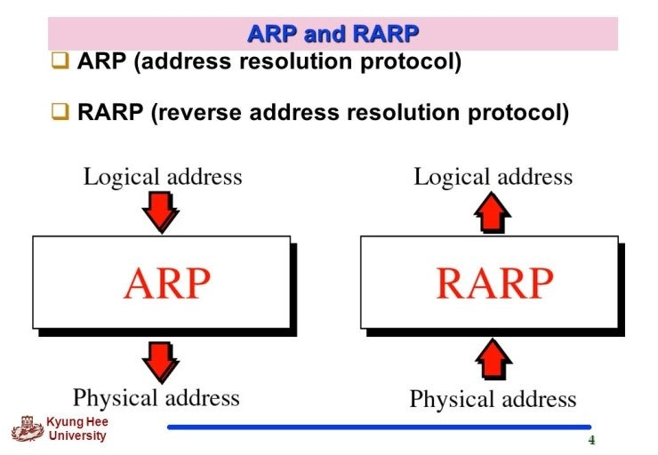

- A라는 ARP Request 브로드 캐스트를 보내 IP 주소인 120.70.80.3에 해당하는 MAC 주소를 찾음. 해당 주소에 맞는 장치 B가 ARP Reply 유니캐스트를 통해 MAC 주소를 반환하는 과정을 거쳐 IP 주소에 맞는 MAC 주소를 찾음.

- 브로드캐스트: 송신 호스트가 전송한 데이터가 네트워크에 연결된 모든 호스트에 전송되는 방식
- 유니캐스트: 고유 주소로 식별된 하나의 네티워크 목적지에 1:1로 데이터를 전송하는 방식

- 홉하이홉 통신이란?
  - IP 주소를 통해 통신하는 과정 (각 패킷이 여러개의 라우터를 건너가는 모습을 비유)
  - PC -> 서브네트워크 -> 라우팅 테이블 -> 서브네트워크 -> 라우팅 테이블 -> PC
- 라우팅이란? 
  - IP 주소를 찾아가는 과정

```
📦 데이터 전송 흐름
1. A는 D에게 메시지를 보내고 싶음. 하지만 A는 D로 가는 전체 경로를 모르고, 바로 옆에 있는 B만 알고 있음.
2. A는 데이터를 B에게 전달.
3. B는 데이터를 받아서, 다음 목적지인 C에게 전달.
4. C는 데이터를 받아서 최종 목적지인 D에게 전달.
5. D가 데이터를 수신!

-> 즉, A는 D를 직접 알 필요 없고, 각 노드가 자기 다음 홉(hop)만 알면 되는 구조.
```

- 라우팅 테이블이란?
  - 송신지에서 수신지까지 도달하기 위해 사용되며 라우터에 들어가 있는 목적지 정보와 그 목적지로 가기 위한 방법이 들어 있는 리스트
  - 게이트웨이와 모든 목적지에 대해 해당 목적지에 도달하기 위해 거쳐야 할 다음 라우터의 정보를 가지고 있음

- 게이트웨이란?
  - 통신망, 포로토콜을 사용하는 네트워크 간의 통신을 가능하게 하는 관문 역할을 하는 컴퓨터 또는 소프트웨어를 가리키는 용어

### 2.4.3 IP 주소 체계

- IP 주소는 IPv4, IPv6로 나뉨.
  - IPv4란? 32비트를 8비트 단위로 점을 찍어 표기 111.30.99.34
  - IPv6란? 64비트를 16비트 단위로 점을 찍어 표기 20001:db8:ff00

- 클래스 기반 할당 방식
  - IP 주소 체계는 발전하고 있고, 처음에는 A,B,C,D,E 다섯 개의 클래스로 구분하는 클래스 기반 할당 방식 사용
  - 네트워크의 첫번째 주소는 네트워크로 사용됨
  - 가장 마지막 주소는 브로드 캐스트용 주소로 네트워크에 속해 있는 모든 컴퓨터에 데이터를 보낼 때 사용됨
  - 하지만 이러한 방식은 사용하는 주소보다 버리는 주소가 많은 단점이 존재했고, 이를 해소하기 위해 DHCP와 IPv6, NAT 등장

- DHCP란?
  - IP 주소 및 기타 통신 매개변수를 자동으로 할당하는 위한 네트워크 관리 프로토콜
  - 수동 설정할 필요 없이 인터넷에 접속할 때 마다 IP 주소를 자동 할당 가능

- NAT란?
  - 패킷이 라우팅 장치를 통해 전송되는 동안 패킷의 IP 주소 정보를 수정해 IP 주소를 다른 주소로 매핑하는 방법
  - NAT를 사용하면 사용하는 IP주소와 외부에 드러나는 IP 주소가 다르기 때문에 내부 네트워크에 대한 어느 정도의 보안이 가능해짐
  - 네트워크 주소를 변환하는 기술
  - 내부(사설 IP)를 외부(공인 IP)로 바꿔주는 역할. 즉, 내부에서 나가는 트래픽에는 공인 IP를 씌우고, 응답이 돌아오면 다시 그걸 내부 주소로 돌려줌.

- ✨NAT의 필요성
  - 우리가 인터넷에 연결될 때 **공인 IP 주소(인터넷에 보이는 주소)**가 필요.
하지만 공인 IP는 한정되어 있어서, 집이나 회사처럼 여러 대의 컴퓨터가 하나의 인터넷 회선을 공유할 땐 모든 기기에 공인 IP를 줄 수가 없음.

```
🏠 예시로 보는 NAT (집의 인터넷 구성)

내부 컴퓨터 A: 192.168.0.2
내부 컴퓨터 B: 192.168.0.3
공유기(라우터): 내부 주소 192.168.0.1 / 공인 주소 123.45.67.89

💻 A가 구글(8.8.8.8)에 접속하고 싶을 때
A는 구글에 요청을 보냄 → 출발지 IP: 192.168.0.2, 목적지: 8.8.8.8

이 트래픽은 공유기(라우터)로 감
공유기는 NAT를 사용해서 IP를 변환
출발지 IP를 123.45.67.89로 바꿈

그리고 A의 포트 번호를 예
54321이라고 기억해 둠

인터넷에는 이렇게 나감
출발지: 123.45.67.89:54321, 목적지: 8.8.8.8:80

구글이 응답을 보내옴
도착지: 123.45.67.89:54321

공유기는 이걸 보고
이 포트는 192.168.0.2가 요청한 거였지! 하고 다시 바꿔서 A에게 전달

📌 이 모든 과정을 공유기가 알아서 처리하는 게 바로 NAT!
```

### 2.4.4 IP 주소를 이용한 위치 정보
- IP는 인터넷에서 사용하는 네트워크 주소이기 떄문에 이를 통해 위치 추적이 가능

## 2.5 HTTP

### 2.5.1 HTTP/1.0

- HTTP 1.0 기본적으로 한 연결당 하나의 요청을 처리하도록 설계. 이는 RTT 증가
- RTT란?
  - 패킷이 목적지에 ㄷ달하고 나서 출발지로 돌아오기까지 걸리는 시간이며 패킷 왕복 시간
- 문제점
  - 서버로부터 파일을 가져올 때마다 TCP의 3-way-handshake를 발생. 따라서 RTT가 시간이 증가

- RTT의 증가를 해결하기 위한 방법
  - 이미지 스플리팅
  
  - 코드 압축
    - bundler (webpack, turbopack, vite)
  - 이미지 Base64 인코딩
  - code splitting
  - CDN
  - 캐시 사용
  - Prefetch
  - Service worker

### 2.5.2 HTTP/1.1

- keep-alive 옵션을 통해 여러 개의 파일을 송수신할 수 있게 변환 (1.0에도 있었지만 현재 default 값)
  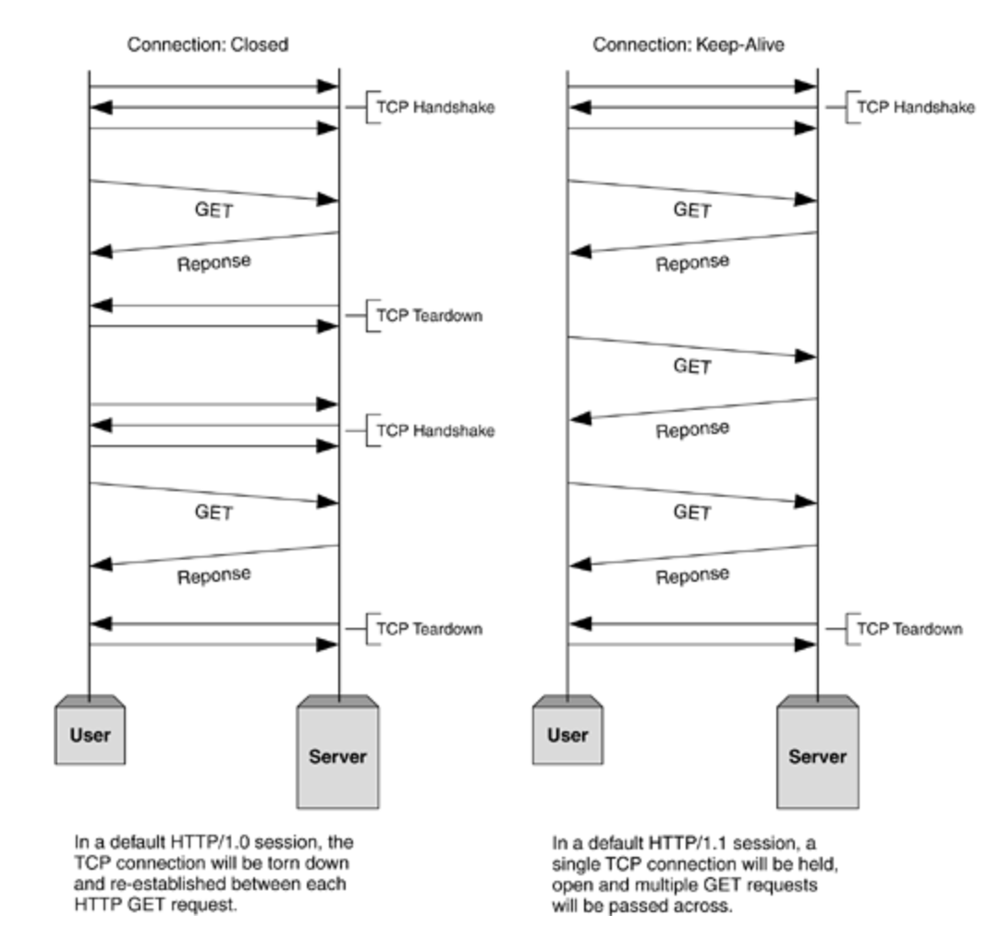

- HOL Blocking
  - 같은 큐에 존재하는 패킷이 그 첫번 째 패킷에 의해 지연될 때 발생하는 성능 저하를 의미
  - image.jpg, styles, css, data.xml을 다운받을 때 순차적으로 받지만 image.jpg가 느리게 받아진다면 지연됨

### 2.5.3 HTTP/2

- 멀티플렉싱
  - 여러 개의 스트림을 이용해 송수신하는 것
  - 위에서 특정 패킷에서 저하가 발생하는 단점 해결했지만 TCP를 사용하기 때문에 근본적인 문제는 해결되지 않음
  - 이런 문제는 근본적으로 애플리케이션 계층(L4)에서 해결한 것 뿐 전송 계층(L3)에서 문제가 발생시 똑같은 HOL Blocking 이슈가 발생함
  ```
  TCP는: 데이터를 순서대로 받도록 보장
  패킷이 유실되면 재전송함
  재전송된 패킷이 도착할 때까지 나머지 데이터도 처리하지 않음

  즉, 하나의 패킷이 유실되면 → 그 뒤에 오는 데이터들도 기다림
  ```

- 스트림이란?
  - 시간이 지남에 따라 사용할 수 있게 되는 일련의 데이터 요소를 가리키는 데이터 흐름
  - 조각조각 받아서 순차적으로 처리하는 흐름
- 멀티플렉싱이란?
  - 하나의 커넥션으로 동시에 여러개의 메세지 스트림을 응답 순서에 상관없이 주고 받는 것을 멀티플렉싱

  ```
  [ Connection (1개) ]
       └── Stream 1
             ├── Frame (Header)
             └── Frame (Data)
       └── Stream 3
             ├── Frame (Header)
             └── Frame (Data)
       └── Stream 5 ...
  ```

  ```
  📦 작동 방식
  클라이언트가 TCP 연결 1개만 생성
  HTML, CSS, JS, 이미지 등 요청을 각각 Stream으로 나눔

  이 Stream을 Frame 단위로 분해
  모든 Frame은 Connection 위로 교차 전송 (Interleaving)

  서버는 Frame을 조립해서 응답하고, 브라우저는 동시에 렌더링 가능
  ```

- 헤더 압축 사용
- 서버 푸시
  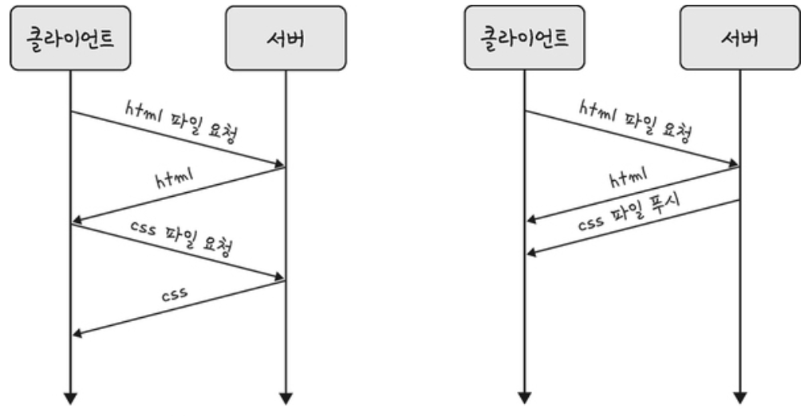
  - 클라이언트 요청 없이 서버가 바로 리소스를 푸시할 수 있는 것
  - html에는 css, js파일이 포함되어 있는데. html을 읽으며 그 안에 있던 파일을 서버에서 푸시해 클라이언트에게 먼저 줄 수 있음

### 2.5.4 HTTPS
- http/2는 https 위에서 동작. https는 애플리케이션 계층과 전송 계층 사이에 신뢰 계층인 SSL/TLS 계층을 넣는 신뢰할 수 있는 http 요청을 의미

- SSL/TLS
  - 전송 계층에서 보안을 제공하는 프로토콜
  - 통신할 때 제 3자가 메세지를 도청하거나 변조하지 못하게 함
  - 보안 세션을 기반으로 데이터 암호화하고, 만들 때 다양한 알고리즘 사용 (해싱, 키 교환 암호화)

- 보안 세션이란?
  - 보안이 끝나는 동안 유지되는 세션, 핸드쉐이크를 통해 보안 세션을 생성

- SSL/TLS가 필요한 이유
  - 같은 네트워크에 있는 누군가가 wireshark 사용으로 패킷 스니핑을 통해 http라면 접속 정보가 다 보임
  ```
  POST /login HTTP/1.1
  Host: example.com
  Content-Type: application/x-www-form-urlencoded

  username=admin&password=1234
  ```

- SSL/TLS 동작 과정
```
1. ClientHello 클라이언트(예: 브라우저)가 먼저 요청을 보냄

내가 지원하는 TLS 버전
내가 지원하는 암호화 방식 목록 (Cipher Suites)
랜덤 값 (Client Random)

ClientHello
- TLS version: 1.3
- Cipher Suites: [TLS_AES_128_GCM_SHA256, ...]
- Client Random: abc123...

2. ServerHello + 인증서 전송
서버가 다음 정보를 응답으로 보냄

서버가 선택한 암호화 방식
서버 랜덤 값 (Server Random)
디지털 인증서 (보통은 공개키 포함)

ServerHello
- Cipher Suite: TLS_AES_128_GCM_SHA256
- Server Random: xyz987...
- Certificate: 인증기관(CA)로부터 받은 인증서

3. 인증서 검증
클라이언트는 서버의 인증서를 검토

이게 신뢰된 인증기관(CA) 에서 발급한 건지 확인
도메인이 일치하는지, 유효기간 확인
다 OK면 통과

4. 비밀 공유 (Key Exchange)
서버의 공개키로 클라이언트가 대칭키를 암호화해서 보냄

이렇게 하면 중간에서 엿보는 사람도 못 봄
서버만 복호화할 수 있음 (왜? 개인키는 서버만 가지고 있으니까)

TLS 1.3에선 이 과정이 Diffie-Hellman으로 바뀌면서 더 안전해짐

5. Finished (암호화 준비 완료)
양쪽 모두 같은 대칭키를 가지고 있게 됨.
이제부터는 모든 데이터가 이 키로 암호화돼서 오고 감.

6. 이후는 안전한 통신 🔐
요청과 응답 모두 대칭키로 암호화된 채로 주고받음

📦 ClientHello --------> 서버야 통신하자! (내 암호화 방식들 줄게)
📦 <-------- ServerHello + 인증서 (내 공개키도 줄게)
🔍 인증서 검증 (이거 믿을만한 서버인가?)
🗝️ 대칭키 생성 + 서버 공개키로 암호화해서 전달
🛡️ 이후부터 대칭키로 안전하게 통신!

refer
https://brunch.co.kr/@swimjiy/47
```

- 디피-헬만 키 교환 암호화 알고리즘
  - 암호키를 교환하는 방법
  - g와 x와 p를 안다면 y는 구하기 쉽지만 g와 y와 p만 안다면 x를 구하기는 어렵다는 원리에 기반한 알고리즘
- 해싱 알고리즘
  - SHA-256
    - SHA-256은 아무 길이의 데이터 → 256비트 해시로 변환해주는 단방향 암호화 함수로,
      보안, 블록체인, 인증 시스템 등에서 핵심적으로 쓰이는 알고리즘

- HTTPS는 SEO 점수에도 도움이 됨. (구글에서 선언)

### 2.5.5 HTTP/3
- HTTP/3 QUIC 계층 위에서 작동, TCP 기반이 아닌 UDP 기반으로 돔.

- 왜 TCP가 아닌 UDP?
  - TCP를 사용한 통신에선 패킷은 신뢰성을 위해 무조건 순서대로 처리.
  - 또한 패킷이 처리되는 순서 또한 정해져있으므로 이전에 받은 패킷을 파싱하기 전까지는 다음 패킷을 처리할 수도 없음.
  - 만일 중간에 패킷이 손실되어 수신 측이 패킷을 제대로 받지 못했으면 다시 보내야 함.
  - 이렇게 패킷이 중간에 유실되거나 수신 측의 패킷 파싱 속도가 느리다면 통신에 병목이 발생하게 되는데, 이러한 현상을HOLB(Head of line Blocking)라고 부름
  -> 따라서 이런 고질적인 문제들을 해결하기 위해 HTTP/3는 TCP를 버리고 UDP를 선택.

- UDP는 신뢰성이 없는데 사용해도 될까?
  - UDP는 가상회선 패킷 교환 방식이 아닌 데이터 그램 패킷 교환 방식 사용하는 프로토콜
  - 따라서 목적지가 정해졌다면 중간 경로를 신경쓰지 않아도 되기에 핸드쉐이크 과정이 필요없음
  - TCP는 신뢰성을 얻기 위해 핸드쉐이크 과정을 진행하는데 UDP는 신뢰성이 없는데 사용해도 될까?
  - UDP는 커스터마이징이 가능함. 개발자가 어떻게 커스터마이징 하느냐에 따라 신뢰성이 올라감.

https://inpa.tistory.com/entry/WEB-%F0%9F%8C%90-HTTP-30-%ED%86%B5%EC%8B%A0-%EA%B8%B0%EC%88%A0-%EC%9D%B4%EC%A0%9C%EB%8A%94-%ED%99%95%EC%8B%A4%ED%9E%88-%EC%9D%B4%ED%95%B4%ED%95%98%EC%9E%90#quic%EC%9D%98_%EA%B3%84%EC%B8%B5_%EC%9C%84%EC%B9%98