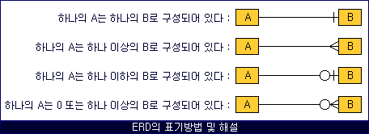

# 경훈

## 4.1 데이터베이스의 기본

### 4.1.1 엔티티

- 엔티티는 사람, 장소, 물건, 사건, 개념 등 여러 개의 속성을 지닌 명사를 의미
- 예로 회원 엔티티는 이름, 아이디, 주소 등의 속성을 가짐

- 약한 엔티티와 강한 엔티티
  - A가 혼자서 존재하지 못하고 B의 존재 여부에 따라 종속적이라면 A는 약한 엔티티 B는 강한 엔티티

### 4.1.2 릴레이션

- 데이터베이스에서 정보를 구분해 저장하는 기본 단위
- 엔티티에 관련된 데이터를 데이터베이스는 릴레이션 하나에 담아 관리
- 릴레이션 = 엔티티에 해당하는 데이터를 담는 테이블
- 하나의 릴레이션은 행(row, 튜플)과 열(column, 속성)으로 구성됨

### 4.1.3 속성

- 속성은 릴레이션에서 관리하는 구체적이며 고유한 이름을 갖는 정보
- 릴레이션(테이블)에서 각 열(column)이 하나의 속성
- 각 속성은 고유한 이름을 갖고, 같은 종류의 데이터를 저장함

### 4.1.4 도메인

- 릴레이션에 포함된 각각의 속성들이 가질 수 있는 값의 집합을 의미

### 4.1.5 필드와 레코드

- 엔티티의 테이블로 속성을 가지고 있고, 각각의 필드가 존재 (열의 한 칸)
- 테이블에 쌓이는 행 단위의 데이터를 레코드 또는 튜플이라고 함 (행의 한 줄)

- 필드 타입
  - 숫자 타입: TINYINT, SMALLINT, MEDIUMINT, INT, BIGINT
  - 날짜 타입: DATE, DATETIME, TIMESTAMP
  - 문자 타입: CHAR, VARCHAR
    - CHAR: 고정 길이 문자열 CHAR(100) 선언시 10글자만 입력해도 100바이트로 저장, 유동적이지 않는 문자 저장시
    - VARCHAR: 가변 길이 문자열, 데이터 용량에 따라 가변시켜 저장, 유동적인 길이 문자 저장시
  - TEXT와 BLOB
    - 두 타입 모두 큰 데이터를 저장할 때 쓰는 타입
    - TEXT: 킅 문자열 저장 주로 게시판 본문
    - BLOB: 이미지, 동영상 등 큰 데이터 저장. 보통 cloud에 올리고 파일 경로를 VARCHAR에 저장
  - ENUM과 SET
    - ENUM
      - 특정 문자열 중 하나만 선택 가능한 데이터 타입
      - 미리 정의된 문자열 리스트에서 단 하나의 값만 저장할 수 있어요.
      - 예시: ENUM('red', 'green', 'blue') → 저장 가능한 값은 'red', 'green', 'blue' 중 하나뿐
    - SET
      - 여러 개의 문자열을 조합해서 저장 가능한 데이터 타입
      - 미리 정의된 문자열 리스트에서 0개 이상 여러 값을 콤마로 조합해 저장할 수 있어요.
      - 예시: SET('a', 'b', 'c', 'd') → 'a', 'a,c', 'b,d' 같은 복수 조합도 저장 가능 

### 4.1.6 관계

- DB에 테이블은 하나만 있는 것이 아니기 때문에 여러 개의 테이블이 서로 관계를 관계 화살표로 정리함



- 1:1 관계
  - 두 엔티티 각각에서 대응되는 데이터가 정확히 한 개씩 존재함
  - 외래키(Foreign Key)를 이용해 구현하며, 보통 외래키에 유니크 제약조건을 함께 걸어 1:1임을 보장함
  - 엔티티를 분리하는 이유는 보통 데이터가 논리적으로 구분되거나, 선택적 속성을 따로 관리할 때

- 1:N 관계
  - 한 유저가 여러 개의 상품을 장바구니에 넣을 수 있음
  - 상품 테이블에 user_id (외래키)를 넣어서 어느 유저가 장바구니에 넣었는지 표시
  - 즉, 상품(또는 장바구니 아이템)이 여러 개 있어도 각각 어떤 유저 소유인지 알 수 있음

- N:M 관계
  - 학생도 강의를 많이 들을 수 있고 강의도 여러명의 학생을 포함 가능
  - 직접 두 테이블에 외래키를 넣는 것은 어렵기 때문에
  - 중간 테이블(조인 테이블) 을 만들어서 관계를 관리함

### 4.1.7 키

- 테이블 관계를 명확하게 하고 테이블 자체의 인덱스를 위해 설정된 장치로 기본키, 외래키, 후보키, 슈퍼키, 대체키가 존재
- 슈퍼키는 유일성이 있고, 그 안에 포함된 후보키는 최소성을 갖춤.
- 후보키 중에서 기본키로 선택되지 못한 키는 대체키가 됨.
- 유일성은 중복되는 값이 없고, 최소성은 필드를 조합하지 않고 최소 필드만 써서 키를 형성할 수 있음

- 기본키
  - 유일성, 최소성 만족하는 키
  - 테이블 데이터가 고유해야하는 속성
  - 예시: user_id, order_id

- 자연키
  - 중복된 값들을 제외하며 중복되지 않는 것을 자연스럽게 뽑다가 나오는 키
  - 예시: 주민등록번호, 이메일 주소 등

- 인조키
  - 인위적으로 유저 아이디를 부여, 고유 식별자가 생김
  - 보통 기본키는 인조키로 설정
  - 보통 AUTO_INCREMENT나 UUID 같은 값

- 외래키
  - 다른 테이블의 기본키를 그대로 참조하는 값
  - 외래키는 중복되어도 괜찮음

- 후보키
  - 기본키가 될 수 있는 후보, 유일성과 최소성을 동시에 만족하는 키

- 대체키
  - 후보키가 두 개 이상일 경우 어느 하나를 기본키로 지정하고 남은 후보 키

- 슈퍼키
  - 각 레코드를 유일하게 식별할 수 있는 유일성을 갖춘 키

## 4.2 ERD와 정규화 과정

- 제 1정규형
  - 도메인이 더 이상 분해될 수 없는 원자 값만으로 구성
  - 속성 값 중 한 개의 기본키에 대해 두 개 이상의 값을 가지는 반복 집합이 있어서는 안됨

- 제 2정규형
  - 제 1정규형이며 부분 함수의 종속성을 제거한 형태를 의미
  - 부분 함수 종속성(Partial dependency) 제거
  → 기본키가 여러 컬럼(복합키)로 구성된 경우, 기본키의 일부에만 의존하는 컬럼이 없어야 해요.
  → 즉, 기본키 전체에 완전히 의존하는 컬럼만 남겨야 함.
  - 쉽게 말하면
  → 기본키가 (A, B)일 때, 컬럼 C가 A에만 의존하면 안 되고, (A, B) 전체에 의존해야 한다는 뜻이에요.
  → 부분적으로만 의존하는 컬럼은 따로 분리해야 함.

- 제 3정규형
  - 제 2정규형이고 기본키가 아닌 모든 속성이 이행적 함수 종속을 만족하지 않는 상태
  - 이행적 함수 종속
    - A -> B, B -> C 일 경우 C -> A를 만족하는 것 

- 보이스 / 코드 정규형
  - 제 3정규형이고, 결정자가 후보키가 아닌 함수 종속 관계를 제거하여 릴레이션의 함수 종속 관계에서 모든 결정자가 후보키인 상태를 의미

## 4.3 트랜잭션과 무결성

### 4.3.1 트랜잭션

- 트랜잭션은 DB에서 작업 단위를 의미하고, DB에 접근하는 방식은 쿼리이기에, 여러 개의 쿼리들을 하나로 묶는 단위를 의미. 이에 대한 특징은 원자성, 일관성, 독립성, 지속성이 있으며 ACID 특징이라고 함

- 원자성
  - 트랜잭션과 관련된 일이 모두 수행되었거나 되지 않았거나를 보장하는 특징
  - 트랜잭션 단위로 여러 로직들을 묶을 때 외부 API 호출이 발생해서는 안됨
  - 있다면 어떻게 해야 할 것인지 해결 방법이 있어야 하고 트랜잭션 전파를 신경 써서 관리해야함

- 커밋과 롤백
  - 커밋은 여러 쿼리가 성공적으로 처리되었다고 확정하는 명령어. 트랜잭션 단위로 수행 및 변경된 내용이 저장되는 것을 의미 (커밋이 수행 === 트랜잭션이 성공적으로 수행)
  - 에러로 인해 트랜잭션 전으로 돌려야 한다면? 이것을 롤백이라고 함. 롤백은 트랜잭션으로 처리한 하나의 묶음 과정을 일어나기 전으로 돌리는 것

- 트랜잭션 전파
  - 트랜잭션을 수행할 때 커넥션 단위로 수행하기 때문에 커넥션 객체를 넘어서 수행해야 함. 하지만 이를 매번 넘겨주기 어려워 수행하지 않고 여러 트랜잭션 관련 메서드의 호출을 하나의 트랜잭션에 묶이도록 하는 것

- 일관성
  - 데이터를 허용된 방식으로만 변경하는 것

- 격리성
  - 트랜잭션 수행 시 서로 끼어들지 못하는 것
  - 복수의 병렬 트랜잭션은 서로 격리되어 마치 순차적으로 실행되는 것 처럼 작동되어야 함
  - DB는 여러 사용자가 같은 데이터에 접근할 수 있어야 함
  - 격리 수준이 약해지면 동시성이 강해지고 격리 수준이 강해지면 동시성이 약해짐

- 격리 수준에 따라 발생하는 현상
  - 팬텀 리드
    - 한 트랜잭션 내에서 동일한 쿼리를 보냈을 때 결과가 다른 경우
    - 다른 트랜잭션이 새로운 행을 INSERT하고 커밋했기 때문
  - 반복 가능하지 않은 조회: 한 트랜잭션 내에서 같은 행에 두 번 이상 조회가 발생했는데, 그 값이 다른 경우
    - 다른 트랜잭션이 그 행의 값을 수정하고 커밋했기 때문
    ```
    트랜잭션 A가 SELECT * FROM user WHERE id = 1 → 결과: 이름 "Alice"
    트랜잭션 B가 같은 행의 이름을 "Bob"으로 바꾸고 커밋함
    트랜잭션 A가 다시 조회 → 이름이 "Bob"으로 바뀜
    같은 쿼리인데 결과가 다름 → 반복 불가능한 조회
    ```
  - 더티리드
    - 반복 가능하지 않는 조회와 유사하며 한 트랜잭션이 실행 중일 때 다른 트랜잭션에 의해 수정되었지만 아직 '커밋하지 않은' 행의 데이터를 읽을 수 있을 경우

- 지속성
  - 성공적으로 수행된 트랜잭션은 영원히 반영되어야 하는 것
  - DB에 장애가 발생해도 원래 상태로 복구하는 회복 기능이 있어야 함
  - DB는 이를 위해 체크섬, 저널링, 롤백 등의 기능 제공

  - 체크섬: 중복 검사를 해 오류 정정을 통해 송신된 자료의 무결성을 보호하는 방법
  - 저널링: DB 시스템에 변경 사항을 커밋하기 전에 로깅하는 것, 트랜잭션 등 변경 사항에 대한 로그를 남기는 것

### 4.3.2 무결성 

- 데이터의 정확성, 일관성, 유효성을 유지하는 것을 말함
- 무결성이 유지되어야 DB에 저장된 데이터 값이 현실 세계 값과 일치

| 무결성 종류     | 설명                     | 예시                    |
| ---------- | ---------------------- | --------------------- |
| 개체 무결성     | 기본키는 NULL이거나 중복되면 안 됨  | `id INT PRIMARY KEY`  |
| 참조 무결성     | 외래키는 참조 대상 테이블의 값이어야 함 | `FOREIGN KEY` 제약      |
| 도메인 무결성    | 컬럼 타입/값/범위 제한          | `CHECK`, `NOT NULL` 등 |
| 사용자 정의 무결성 | 비즈니스 규칙에 따른 조건 정의      | 나이 제한, 구매 조건 등        |


